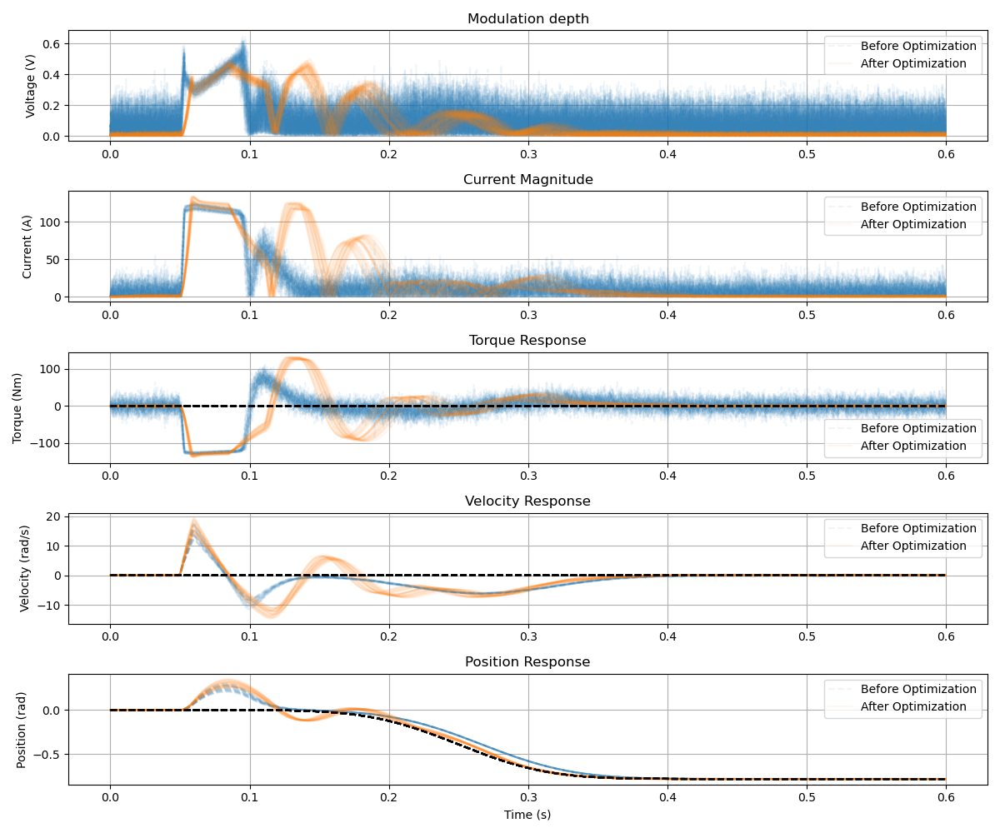
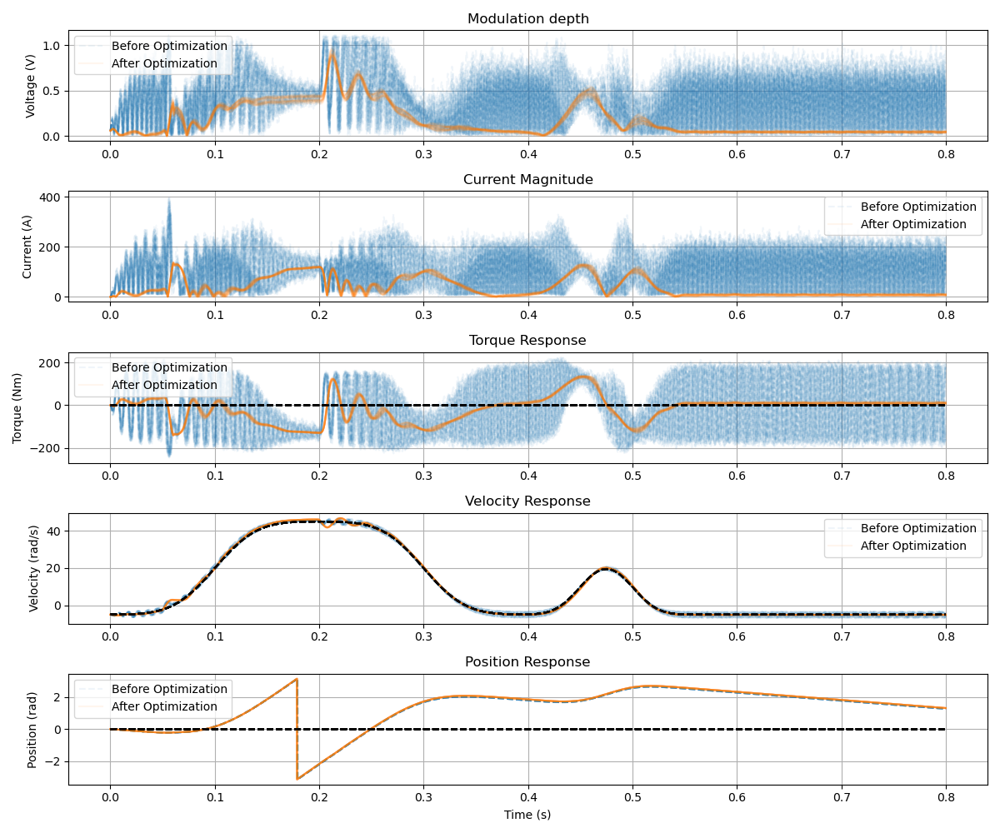
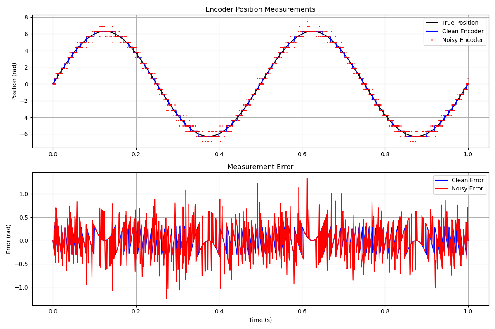

# jax_actuator

**jax_actuator** is a package for optimizing actuator systems. Tuning their
control loops for performance targets and stability margins is nontrivial using
classical techniques, since a number of nonlinearities, limits, and non-Gaussian
noise processes can play a strong role.

jax_actuator allows flexible time-domain modelling of a controller–motor–encoder
system. It aims to be a comprehensive simulation, including electro-magnetic
motor dynamics, sensor noise, encoder noise, and firmware logic. With this in
place, we can characterize and optimize the whole pipeline for internal
controller parameters such as estimator filters and control gains.

> jax_actuator has some unpolished edges, but it is useful for a number of use cases.

## How it works

Optimization for a given cost function is achieved via brute-force rollouts of
populations with domain randomization, and (evolutionary) search over the
parameters. Alternative optimizers could be added, but in my experience this has
been fast enough — and many gradient-based methods fail on the adversarial loss
landscapes involved.

The fuzzy curves in the plots below represent a population of rollouts over all
randomized domain parameters, which is how stability margins are ensured.

## Examples

### Torque application

A motor–controller system optimized for a torque-motor application. At
`t = 0.05`, an external torque exceeding the motor's capability is applied; the
goal is to optimize the motor to hold against this external force as well as
possible. Alongside the external torque impulse, we also optimize for
position-step tracking within the same scenario.

The balance here is in finding a tuning that avoids exceeding the MOSFET maximum
current limits during these regen conditions — we are liable to experience higher
phase currents than the controller ever commands. At the same time, we seek to
keep motor hiss and sensor-noise amplification within reasonable bounds, all
while minimizing tracking error.



Here is a list of the parameters being optimized over. Even for several dozen such parameters, an evolutionary search to find an optimum robust to domain randomization, can be completed on a single laptop in under aminute.
```python
INITIAL_PARAMS = {
    '__position_ctrl__kp': 60.,
    '__position_ctrl__ki': 0.1,
    '__position_ctrl__kd': 0.1,
    '__velocity_ctrl__kp': 30.,
    '__velocity_ctrl__ki': .1,
    '__velocity_ctrl__max_rate': 1e1,
    '__iq_ctrl__kp': 1.0,
    '__iq_ctrl__ki': 1e-3,
    '__iq_ctrl__max_rate': 5e0,
    '__id_ctrl__kp': 1.0,
    '__id_ctrl__ki': 1e-3,
    '__id_ctrl__max_rate': 1e0,
    '__observer__tau_pos': 1.,
    '__observer__tau_vel': 1.,
    '__voltage_feedforward': 0.5,
    '__current_estimator__tau': 0.01,
    '__current_estimator__feedforward': 0.5,
}
```


### Traction application (ABS braking)

This scenario optimizes a traction motor over two acceleration/deceleration
pulses: one pushing toward the voltage limit at speed, and a second at lower
speeds aiming for maximum reaction time. Superimposed is an external torque
demand: We simulate a hard-braking scenario with sudden, complete
loss of external traction at `t = 0.2`, and test the system's ability to maintain the target velocity
command under that disturbance while near the torque and speed limits.

This is a worst case for ABS braking — upon suddenly hitting a patch of near-zero
traction, we want to avoid the wheels locking up. Actual velocity stays within a
few percent of the commanded velocity even in this worst case, while respecting
all other performance constraints, which is a large improvement over a naively
tuned system.



### Encoder simulation

Often encoder resolution is the limiting factor in realistic achievable control bandwidth. Its noise characteristics are highly non-gaussian, which is one of the reasons why tuning the chain of filters and control loops, to optimally balance performance and stability, benefits from a brute force numerical simulation, over simplified analytical models.



### Notes

This repository has only been minimally validated against real world data, and may contain substantial imperfections. But it is a useful proof of concept, of the optimization of motor control systems using brute force optimization, and depending on how much care you put it any derived analyses, should be able to give useful feedback about what the limiting factors of a given setup are.
